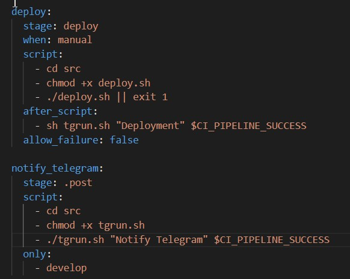

# CI/CD

## Оглавление

[Часть 1. Настройка gitlab-runner ](#Часть1)\
[Часть 2. Сборка ](#Часть2)\
[Часть 3. Тест кодстайла ](#Часть3)\
[Часть 4. Интеграционные тесты ](#Часть4)\
[Часть 5. Этап деплоя ](#Часть5)\
[Часть 6. Дополнительно. Уведомления ](#Часть6)

## 

 Часть 1. Настройка gitlab-runner

- Поднял виртуальную машину `Ubuntu Server 20.04 LTS`

- Скачал и установил на виртуальную машину gitlab-runner

- Запустил gitlab-runner и зарегистрировал его для использования в текущем проекте (DO6_CICD)

## 

 Часть 2. Сборка

- Написал `yaml` файл. Поместил в папку `DO6_CICD-1`. 

    - stages определяет последовательность этапов выполнения.
    - build - это название задачи (job) для этапа сборки.
    - stage: build - указывает, что этот job относится к этапу build.
    - script содержит команды, которые GitLab Runner будет выполнять. Здесь вызывается команда `make`, которая будет запускать процесс сборки проекта с помощью Makefile.
    - artifacts определяет, какие файлы или папки будут сохранены после выполнения этой задачи. В приведенном примере src/artifacts - это путь к собранным артефактам, которые нужно сохранить. При этом команда cd не требуется.
    - expire_in - устанавливает скрок хранения артефактов.

## 

 Часть 3.  Тест кодстайла

- Написал этап для `CI`, который запускает скрипт кодстайла `clang-format`

    - before_script - до начала выполнения основного скрипта копирую файл с кодстайлом в папки с проектами
    - перехожу в необходимые папки
    - проверяю на clang-format
    - exit 1 - заставляет GitLab завершить пайплайн с кодом завершения 1, если команда clang-format завершится с ненулевым кодом (т.е., если будут обнаружены проблемы с кодстайлом).
    - allow_failure: false - указывает GitLab не разрешать "успешное" выполнение пайплайна в случае ошибки в этом этапе.

## 

 Часть 4. Интеграционные тесты

- Написал этап для CI, который запускает интеграционные тесты из того же проекта:

 - Добавляю новый этап и новую задачу `integration_tests`
 - Перехожу в папки с проектами и запускю тесты
 - Выдаю права на выполнение
 - Передаю весь вывод в `*outut.txt` файлы и вывожу на "экран" этот файл с помощью `cat`
 - `dependencies` - этот ключ позволяет указать зависимости данного этапа от успешного завершения других этапов.
 - `allow_failure: false` - указывает GitLab не разрешать "успешное" выполнение пайплайна в случае ошибки в этом этапе.

## 

 Часть 5. Этап деплоя

    - Поднял две виртуальные машины `Ubuntu Server 20.04 LTS`
    - Пропинговал машины между собой (в помошь проект LINUX_NETWORK)

- В файле `gitlab-ci.yml` добавил этап запуска написанного скрипта:
  
  

- Написал `bash-скрипт`, который при помощи `ssh` и `scp` копирует файлы, полученные после сборки (артефакты), в директорию `/usr/local/bin` второй виртуальной машины `ws2 -> ws3`

  

## 

 Часть 6. Дополнительно. Уведомления

- Написал скрипт `tgrun.sh`, который вызывает `API Telegram` и отправляет сообщение нужному пользователю через созданного бота:

  

- Добавил данные бота и пункт `after_script: sh tgrun.sh` в файл  `.gitlab-ci.yml`

  /

- Получили сообщение от бота, об успешном выполнении пайплайна
  
  