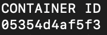
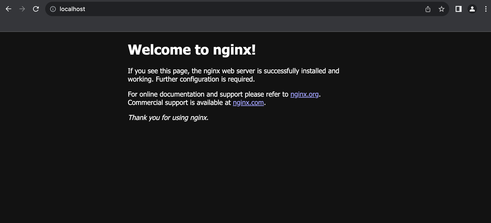
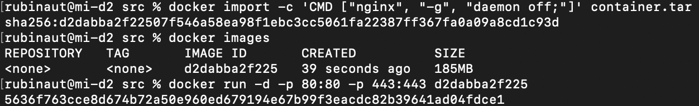
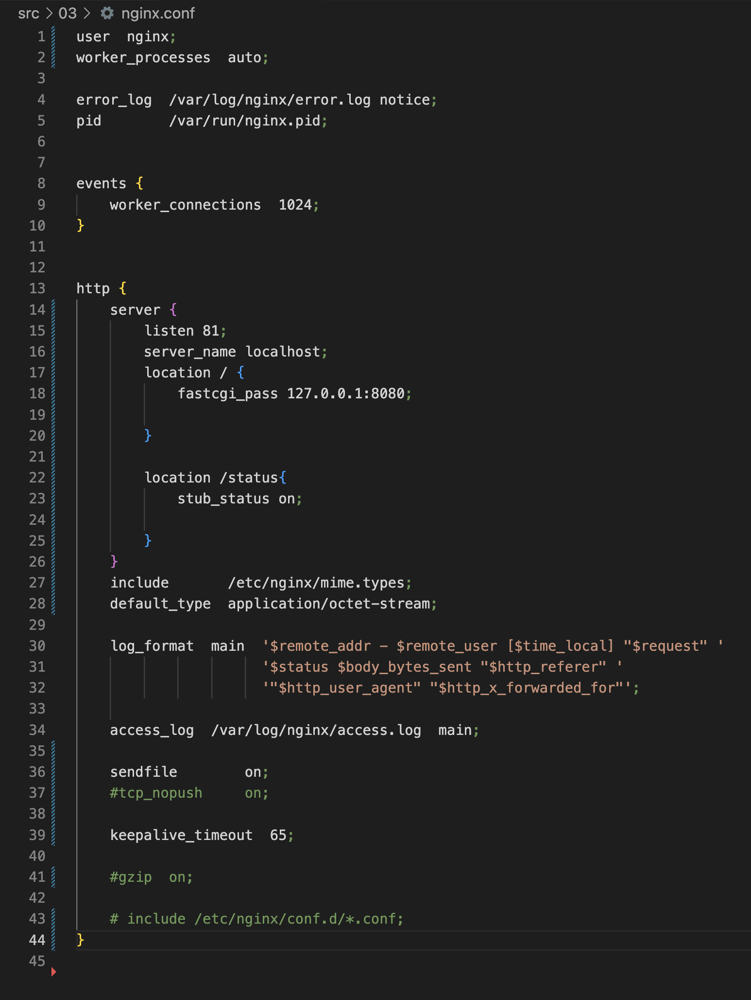

# DOCKER

## Оглавление

[Часть 1. Готовый Docker ](#Часть1)\
[Часть 2. Операции с контейнером ](#Часть2)\
[Часть 3. Мини веб-сервер ](#Часть3)\
[Часть 4. Свой докер ](#Часть3)

## 

 Часть 1. Готовый Docker

- Взял официальный докер образ с `nginx` и выкачал его при помощи `docker pull` 

- Проверил наличие `Docker` образа через `docker images`

- Запустил докер образ через `docker run -d 021283c8eb95`

- Проверил, что образ запустился через `docker ps`

- Посмотрел информацию о контейнере через `docker inspect 05354d4af5f3`

- По выводу команды определил и поместил в отчёт размер контейнера, список замапленных портов и `ip` контейнера

- Остановил докер образ через ` docker stop `

- Проверил, что образ остановился через `docker ps`

- Запустил докер с портами `80` и `443` в контейнере, замапленными на такие же порты на локальной машине, через команду run

- Проверил, что в браузере по адресу `localhost:80` доступна стартовая страница nginx

- Перезапустил докер контейнер через `docker restart`

- Проверил любым способом, что контейнер запустился

## 

 Часть 2. Операции с контейнером 

- Прочитал конфигурационный файл `nginx.conf` внутри докер контейнера через команду `exec`

- Создал на локальной машине файл `nginx.conf`
- Настроил в нем по пути `/status` отдачу страницы статуса сервера `nginx`

- Скопировал созданный файл `nginx.conf` внутрь докер образа через команду `docker cp`

- Перезапустил `nginx` внутри докер образа через команду exec

- Проверил, что по адресу `localhost:80/status` отдается страничка со статусом сервера `nginx`

- Экспортировал контейнер в файл `container.tar` через команду export
- Остановил контейнер

- Удалил образ через `docker rmi`, не удаляя перед этим контейнеры

- Удалил остановленный контейнер

- Импортировал контейнер обратно через команду `import`
- Запустил импортированный контейнер

- Проверил, что по адресу `localhost:80/status` отдается страничка со статусом сервера nginx

## 

 Часть 3. Мини веб-сервер

- Запустил доекр с портами 81, с помощью команды `run`

- Написал мини сервер на **C** и **FastCgi** и свой **nginx.conf** 

\

- Скопировал в docker

- Зашёл в контейнер 

- Запустил 

- Проверил, что в браузере по *localhost:81* отдается написанная вами страничка

- Положил файл `nginx.conf` по пути `04/nginx/nginx.conf`(это понадобится позже)

## 

 Часть 4. Свой докер

- Написал `DOCKERFILE`

- Собрал написанный докер образ через `docker build` при этом указав имя и проверил через `docker images`

\

- Запустил собранный докер образ с маппингом `81` порта на `80` на локальной машине и маппингом папки `./nginx` внутрь контейнера по адресу, где лежат конфигурационные файлы `nginx'а`

- Проверил, что по `localhost:80` доступна страничка написанного мини сервера

- Дописал в `./nginx/nginx.conf` проксирование странички `/status`, по которой надо отдавать статус сервера `nginx`

- Перезапустил докер образ

- Проверил, что теперь по `localhost:80/status` отдается страничка со статусом nginx

## 

 Часть 5. Dockle

- Просканировал образ из предыдущего задания через `dockle [image_id|repository]`

- Исправил образ так, чтобы при проверке через `dockle` не было ошибок и предупреждений

## 

 Часть 6. Базовый Docker Compose

- Написал файл docker-compose.yml

- Внёс изменения 

\

- Собрал и запустил проект с помощью команд `docker-compose build` и `docker-compose up`

\

- Проверил, что в браузере по localhost:80 отдается написанная вами страничка, как и ранее

