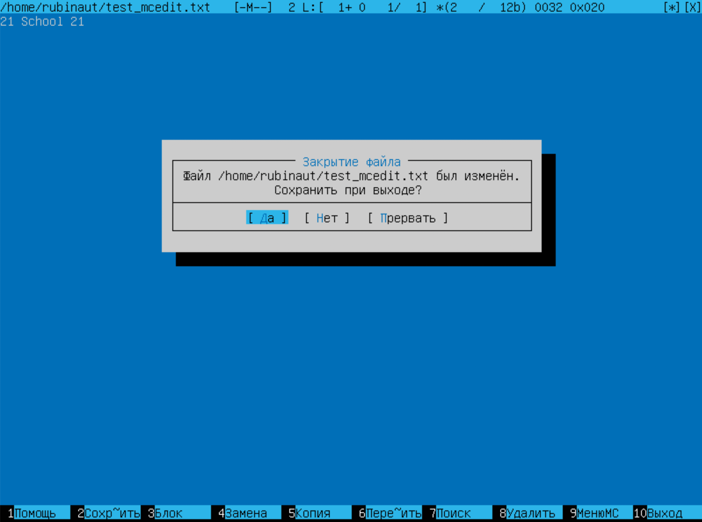
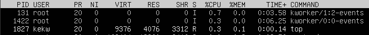

# LINUX
## Table of contents
1. [Part 1. Installation of the OS](#part1)
2. [Part 2. Creating a user](#part2)
3. [Part 3. Setting up the OS network](#part3)
4. [Part 4. OS Update](#part4)
5. [Part 5. Using the sudo command](#part5)
6. [Part 6. Installing and configuring the time service](#part6)
7. [Part 7. Installing and using text editors](#part7)
8. [Part 8. Installing and basic setup of the SSHD service](#part8)
9. [Part 9. Installing and using the top, htop utilities](#part9)
10. [Part 10. Using the fdisk utility](#part10)
11. [Part 11. Using the df utility](#part11)
12. [Part 12. Using the du utility](#part12)
13. [Part 13. Installing and using the ncdu utility](#part13)
14. [Part 14. Working with system logs](#part14)
15. [Part 15. Using the CRON job scheduler](#part15)

 ## 

 Part 1. Installation of the OS 
- Ubuntu 20.04 LTS was installed. The result of `cat /etc/issue` is bellow \
 
 
 ## 

 Part 2. Creating a user
- Creat user \
 
- User was added to adm group \

- The result of `cat /etc/issue` command \

 ## 

 Part 3. Setting up the OS networkr
- Machine name was set to user-1 via edditing `/etc/hostname` and `/etc/hosts` with nano \

- Time zone was set to Europe/Moscow with `sudo timedatectl set-timezone Europe/Moscow` \

- names of the network interfaces were outputted with command `ip link show` \

- lo (loopback device) – виртуальный интерфейс, присутствующий по умолчанию в любом Linux. Он используется для отладки сетевых программ и запуска серверных приложений на локальной машине. С этим интерфейсом всегда связан адрес 127.0.0.1. У него есть dns-имя – localhost.

- ip address of the device `10.0.2.2` \

- DHCP (Dynamic Host Configuration Protocol — протокол динамической настройки узла) — прикладной протокол, позволяющий сетевым устройствам автоматически получать IP-адрес и другие параметры, необходимые для работы в сети TCP/IP.
- External ip \

- internal IP of gw \

- Setting up static ip, gw, dns \

- pinging `1.1.1.1` and `ya.ru` \

 ## 

 Part 4. OS Update
- System packeges were updated with `apt get update` and `apt get upgrade` \

 ## 

 Part 5. Using the sudo command
- The hostname was changed by user1 user the same way as in part 2 \

- sudo allows a permitted user to execute a command as the superuser or another user

 ## 

 Part 6. Installing and configuring the time service
 - time \

## 

 Part 7. Installing and using text editors
### Using each of the three selected editors, create a test_X.txt file, where X is the name of the editor in which the file is created. Write your nickname in it, close the file and save the changes.
- VIM editor. `ZZ (shift + z + z)` to exit file with changes saved

- NANO editor. `^s (CTRL+s)` to save file and `^x` to exit file

- MCEDIT editor. `F2` to save file and `F10` or `ESC` to exit file

### Using each of the three selected editors, open the file for editing, edit the file by replacing the nickname with the "21 School 21" string, close the file without saving the changes.
- VIM editor. `ZQ (shift + z + q)` to exit file without changes saved \

- NANO editor `^x` to exit file and then `N` to choose not to save file \

- MCEDIT editor. `F10` or `ESC` to exit file and choose not to save in popped up window \

### Using each of the three selected editors, edit the file again (similar to the previous point) and then master the functions of searching through the contents of a file (a word) and replacing a word with any other one.
- VIM editor. `:` to enter command mode and `%s/[searh_string]/[replace_string]`. % is needed to search through the whole file \

- NANO editor. `^\` to find and replace \

- MCEDIT editor. `F4` to find and replace \

## 

 Part 8. Installing and basic setup of the **SSHD** service

- Install the SSHd service
    - `sudo apt-get install openssh-server`
- Add an auto-start of the service whenever the system boots
    - `sudo systemctl enable ssh`
    
- Reset the SSHd service to port 2022
    - edit `/etc/ssh/sshd_config` and set port to 2022 \
    

- Show the presence of the sshd process using the ps command. To do this, you need to match the keys to the command.
    - `ps` - report a snapshot of the current processes
    - `-C` - select by command name \
    

- The output of the netstat -tan command \

- Explain the meaning of the -tan keys, the value of each output column, the value 0.0.0.0. in the report.
    - `-t` - show only TCP ports
    - `-a` - show both listening and non-listening sockets
    - `-n` - show numerical addresses instead of trying to detemine symbolic host, port or user names
    - `0.0.0.0` - is a non-routable IPv4 address that can be used for various purposes, mainly as a default or placeholder address
    - `Proto` - The protocol used by the socket
    - `Recv-Q` - The count of bytes not copied ny the user program connected to this socket
    - `Send-Q` - The count of bytes not acknowledged by the remote host
    - `Local Address` - Address and port number of the local end of the socket
    - `State` - The state of the socket
    
## 

 Part 9. Installing and using the **top**, **htop** utilities

- TOP utility \
    
    - Uptime is `13 min`
    - Number of authorised users is `1 user`
    - System load is `0.00` for the last 1, 5 and 15 minutes
    - total number of processes is `119`
    - CPU load `sy` is `0.1`
    - Memory load is `180.8 MiB`
    - pid of the process with the highest memory usage
        - `shift + m` to sort by memory usage 
        - PID : `1635` \
        
    -  pid of the process with the most CPU time
        - `shift + p` to sort by CPU usage 
        - PID: `131` \
        

- HTOP utility
    - Sorted by PID \
    

    - Sorted by PERCENT_CPU \
    

    - Sorted by PERCENT_MEM \
    

    - Sorted by TIME \
    

    - Filtered for sshd process \
    

    - Syslog process found by search \
    

    - Hostname, clock and uptime output added \
    

## 

 Part 10. Using the **fdisk** utility
- Name of hard disk is `VBOX HARDDISK`
- Capacity of the hard disk is `14.67 GiB \ 15747514368 bytes`
- Number of sectors is `30756864`
- Swap size is `1.8 GiB` \
 \

## 

 Part 11. Using the **df** utility
**Root partition (/)**
- Partition size is `9.8 GiB`

- Space used `4.6 GiB`

- Space free `4.7 GiB`

- Percentage used `50%`

- File system type is `ext4 (fourth extended file system)`

## 

 Part 12. Using the **du** utility
- Ran command `du`\

- Size of /home is `140Kb` \

- Size of /var is `541Mb` \

- Size of /var/log is `27Mb` \

- Size of all contents in /var/log `sudo du -ah /var/log/* | less` \
 

## 

 Part 13. Installing and using the **ncdu** utility
- /home
    

- /var
    

 - /var/log
    

## 

 Part 14. Working with system logs
- Login time `16:56`
- Username `rubinaut`
- Login method `pam_unix - Module for traditional password authentication` \

## 

 Part 15. Using the **CRON** job scheduler
- Execution of CRON jobs \

- List of current jobs for CRON \

- List of current jobs for CRON aftherremoving all tasksk from the job scheduler \

