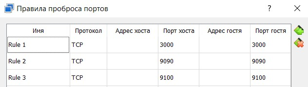
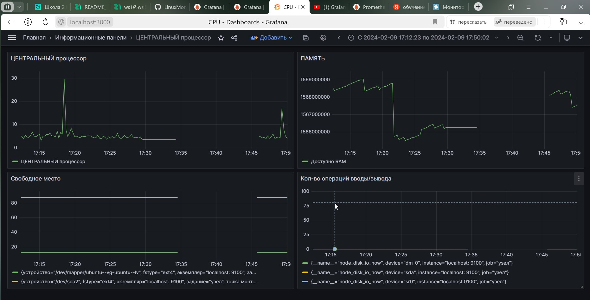
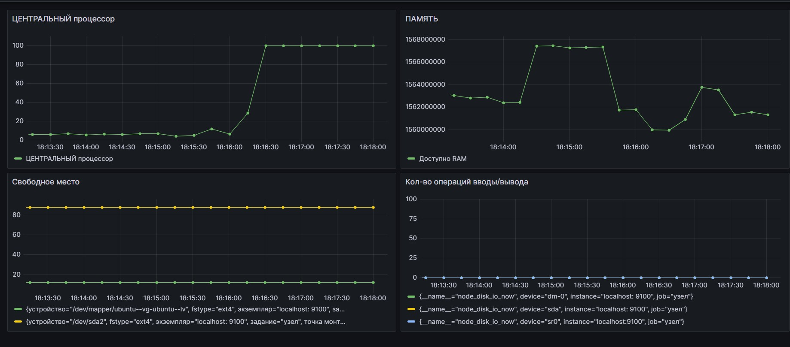
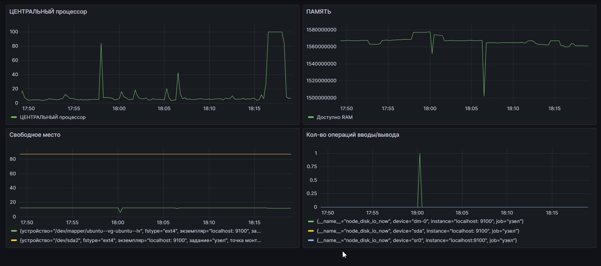

# Part 7. Prometheus и Grafana


### Порты

- Сделал проброс портов, что бы заходить через браузер



### Grafana 

```
#Установка Grafana
sudo apt-get install -y adduser libfontconfig1 musl
wget https://dl.grafana.com/oss/release/grafana_10.1.1_amd64.deb
sudo dpkg -i grafana_10.1.1_amd64.deb

#Запуск и активация Grafana:
sudo systemctl daemon-reload
sudo systemctl start grafana-server
sudo systemctl enable grafana-server

# Доступ к  Grafana по адресу http://localhost:3000 (login and pass: admin).
```

### Prometheus 

```
sudo apt-get install prometheus 
# Установка пакета
sudo systemctl start prometheus
# Запуск прометея
sudo systemctl enable prometheus
# !!!!!
sudo systemctl status prometheus
# Статус рабочего состояния

# Доступ к  Prometheus по адресу http://localhost:9090
```

### Node-exporter

```
sudo useradd --system --no-create-home --shell /bin/false node_exporter
wget https://github.com/prometheus/node_exporter/releases/download/v1.3.1/node_exporter-1.3.1.linux-amd64.tar.gz
tar -xzf node_exporter-1.3.1.linux-amd64.tar.gz
cd node_exporter-1.3.1.linux-amd64
sudo mv node_exporter-1.3.1.linux-amd64/node_exporter /usr/local/bin/

sudo nano /etc/systemd/system/node_exporter.service
#Добавить конфигурацию в файл /etc/systemd/system/node_exporter.service
<<EOF >
[Unit]
Description=Node Exporter
Wants=network-online.target
After=network-online.target

StartLimitIntervalSec=500
StartLimitBurst=5

[Service]
User=node_exporter
Group=node_exporter
Type=simple
Restart=on-failure
RestartSec=5s
ExecStart=/usr/local/bin/node_exporter \
--collector.logind

[Install]
WantedBy=multi-user.target
EOF

#Запустить Node Exporter
sudo systemctl enable node_exporter
sudo systemctl start node_exporter
sudo systemctl status node_exporter

#Создаем таргет для Node Exporter в файле /etc/prometheus/prometheus.yml:
sudo nano /etc/prometheus/prometheus.yml

<<EOF >
    - job_name: "node_export"
        static_configs:
          - targets: ["localhost:9100"]
EOF

# Доступ к  Node-exporter по адресу http://localhost:9100
```

- Добавил на дашборд `Grafana` отображение `ЦПУ`, `доступной оперативной памяти`, `свободное место` и `кол-во операций ввода/вывода на жестком диске`.



- Запустил `bash-скрипт` из Части 2. Посмотрел на нагрузку жесткого диска:



Установил утилиту `stress` и запустил команду `stress -c 2 -i 1 -m 1 --vm-bytes 32M -t 10s`. Посмотрел на нагрузку `жесткого диска`, `оперативной памяти` и `ЦПУ`

