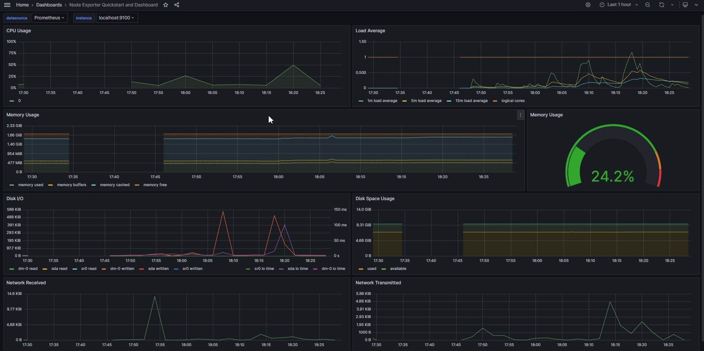
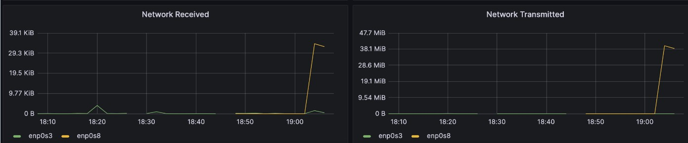

# Part 8. Готовый дашборд

- Скачал Node Exporter Quickstart and Dashboard: 
  https://grafana.com/api/dashboards/13978/revisions/1/download.

- Перешёл по ссылке http://localhost:3000/dashboard/import и загрузил скачанный json.

- Итог:

- Склонировал машину и во внутренней сети настроил статическую маршрутизацию между двумя машинами. Склонированная машина будет сервером, исходная машина - клиентом. На сервере запустим `iperf3 -s`, на клиенте - `iperf3 -c <ip_addr>`:

